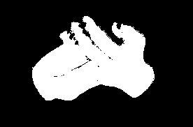
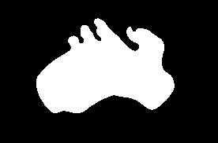

# Prototyp rozwiązania

## Augmentacja danych

### Zmiana koloru skóry

Procedura:
1. Konwersja przestrzeni barw z BGR na HSV
2. Wyznaczenie maski skóry poprzez zdefiniowanie zakresów wartości HSV odpowiadającym kolorowi skóry
3. Oczyszczenie maski z wykorzystaniem operacji morfologicznych, wygładzenia Gaussa oraz progowania
4. Modyfikacja jasności pikseli należących do maski

Wstępne wyniki:

<figure style="text-align: center;">
    
    <figcaption>Oryginalna ręka</figcaption>
</figure>

<figure style="text-align: center;">
    
    <figcaption>Maska skóry na podstawie wartości HSV</figcaption>
</figure>

<figure style="text-align: center;">
    
    <figcaption>Wygładzona maska</figcaption>
</figure>

<figure style="text-align: center;">
    
    <figcaption>Ręka po augmentacji</figcaption>
</figure>

